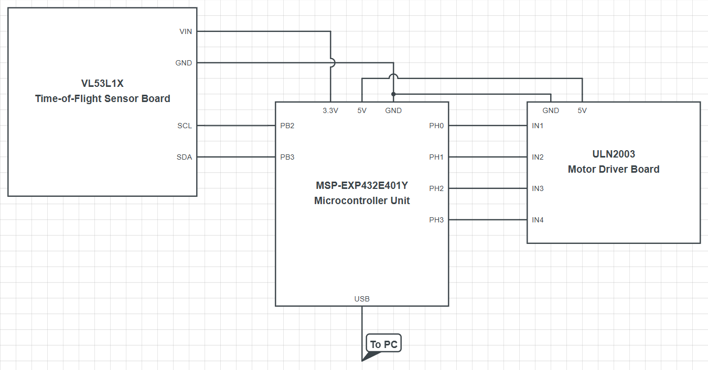
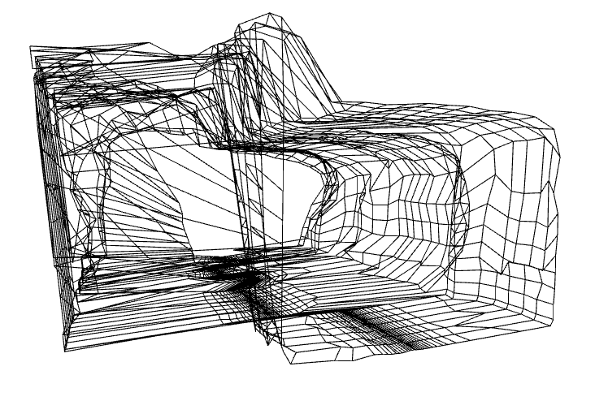
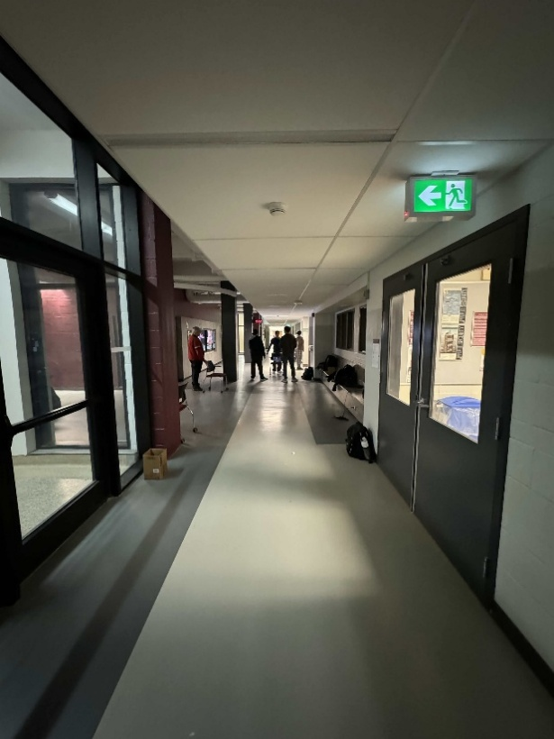
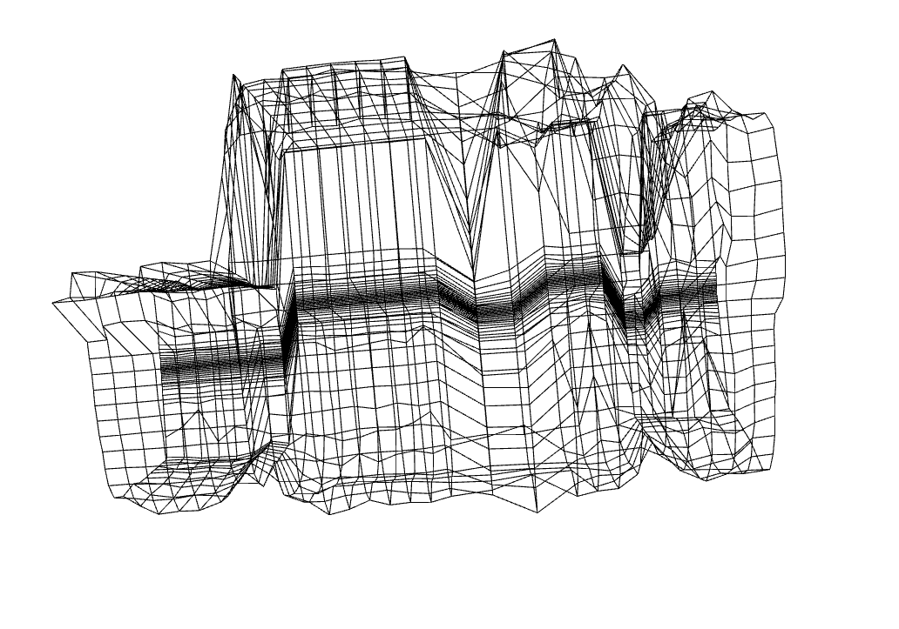
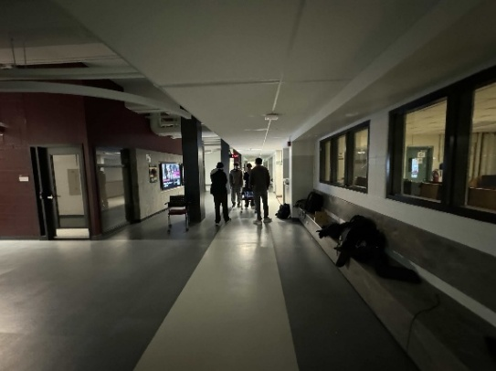

# 3D Environment Scanner
### Purpose:
The purpose of this project is to design, build, and test a device to create 3D maps of indoor enviironments. The project would involve combining a microcontroller, time-of-flight (ToF) sensor, a motor, and a PC to run processing on the collected data.

### Project Setup:

### Results:
After using the 3D Environment Scanner, the data visualization process will begin automatically, first showing the scan as a 3D point cloud, and then showing it as a wireframe model. In both cases, the pop-up windows support click-and-drag controls to view the data from multiple angles in addition to pinch gestures to zoom in and out. After both visualization windows have been closed and the program shuts down, there will be two new files in the folder with the PC application. One will be a .xyz file containing the data points used for visualization, and the other will be a .csv file containing raw measurement data. If the .xyz file is lost, at the start of the next “read” or “append” operation involving this file, the .csv file will be used to regenerate the missing data.

#### Program output:

### Provided resources:
While the specialized parts of this project (i.e., the code to movethe motor and record and process output) were written by me, general modules were provided. These include the files pertaining to the I2C communication protocol (I2C0.h and I2C0.c), the microcontroller clock and wait functions (PLL.c, PLL.h, SysTick.c, and SysTick.h), importand address constants (tm4c129ncpdt.h), the UART communication protocol (uart.c and uart.h), and the ToF sensor's low-level implementation (vl53l1_platform_2dx4.c, vl53l1_platform_2dx4.h, vl53l1_platform.c, vl53l1_platform.h, vl53l1_types_2dx4.h, VL53L1X_api.c, and VL53L1X_api.h).

### Limitations:
Limitations
    1. Precision: Since all data transmitted from the microcontroller are integers, there will be no floating-point precision errors in the data stored in the raw csv file. The coordinates, however, are calculated using floating point numbers for the angle, sine, and cosine functions, meaning there will be a limit to precision. This limit will be determined by the floating-point precision limit of the device.
    2. Quantization Error: The maximum quantization error of the time-of-flight module is approximately 0.061.
    3. Communication Speed: While the maximum standard UART baud rate is 7.5 Mbps, according to the microcontroller’s limitations, this program uses 115,200 bps. This was verified by reviewing the values set in the UART integer baud rate divisor (IBRD) and fractional baud rate divisor (FBRD) registers. These values (8 and 44, respectively) were used in the baud rate calculation formula: $\frac{16MHz}{16\times\left(\text{IBRD}+\frac{FBRD}{64}\right)}=\frac{16,000,000}{16\times\left(8+\frac{44}{64}\right)}=\frac{1,000,000}{8\frac{11}{16}}\approx115107.9\text{ bps}$. This has an error of approximately: $\frac{115200-115107.9}{115299}\times100\%=0.08\%$. This shows that the actual baud rate is extremely close to the listed baud rate.
    4. The microcontroller and time-of-flight sensor communicate via the I2C protocol using a shared clock speed of 100 kbps.
    5. The primary limitation on system speed is the rotation of the motor. For every scanning cycle, the motor will take a few seconds as data is captured and then take a few more seconds to unwind the wires. This is in comparison with the 100Hz scanning speed of the time-of-flight sensor, the 100 kbps clock speed of the I2C communication, the 115,200 bps baud rate of the microcontroller and PC communication, and the 36 MHz clock speed of the microcontroller. Since all data processing is performed on an external PC with a much higher clock speed, the 36MHz clock speed of the microcontroller is more than fast enough to keep the system running quickly.
    6. The bus speed of the microcontroller is determined by the equation $SYSCLK=\frac{\frac{f_\text{SRC}}{(Q+1)(N+1)}\times \text{MINT}}{\text{PSYSDIV+1}}$ (there is another term, MFRAC, that is excluded from this calculation as it is set to 0 for best performance). Therefore, to achieve a system clock of 36MHz using a 25MHz crystal oscillator, N was set to 4, Q was set to 0, MINT was set to 36, and PYSISDIV was set to 4. This yields $\text{SYSCLK}=\frac{\frac{25,000,000}{(0+1)(4+1)}\times36}{4+1}=\frac{5,000,000\times36}{5}=36,000,000Hz=36\text{ MHz}$.
    7. The first LED, D1, indicates the a measurement is occurring. The next one, D2, indicates a UART transmission is taking place, and the third one, D3, indicates that measurements are paused while the motor unwinds the wires.

### Usage:
After setting up the 3D Environment Scanner, run the Hallway_Scan_App.py file using Python 3.11. Indicate whether you are creating a new file “n”, appending to an existing file “a”, or simply reading data from an existing file (i.e., repeating the visualization stage without collecting new measurements) “r”. If appending to a file, you will need to indicate which scan you are appending. Scans are zero-indexed, meaning the first scan is scan 0. If the number of the last scan is unknown, the raw.csv file that is generated can be consulted, where the file column is the scan number. Similarly, the first column of the .xyz file can be consulted to determine the last scan number. In this case, divide the number in the first column by the value of the SCAN_DISTANCE variable to get the scan number (defaults to 300). Once this value is entered, the steps for the “append” and “new” options are the same: press the start button (PJ0) on the device, let the motor spin a full circle, and then unwind. Once complete, either press start on the device again to take another scan or press the terminate button (PJ1) to stop data collection and visualize the data. If, at any time, data collection needs to be paused (for example, a person needs to walk through the path of the sensor), then press PJ0 to pause data collection and the motor’s rotation. When ready to continue, press PJ0 again to resume. No steps need to be taken on the side of the PC software.